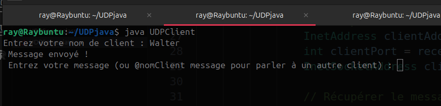
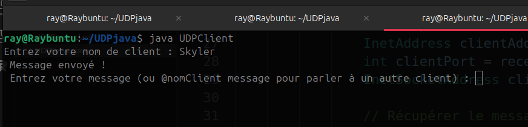
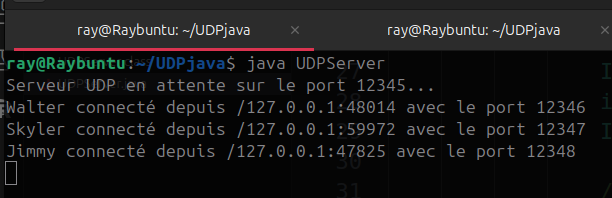
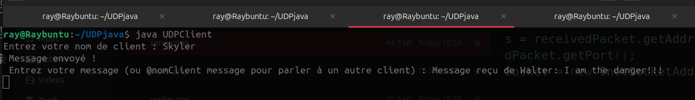
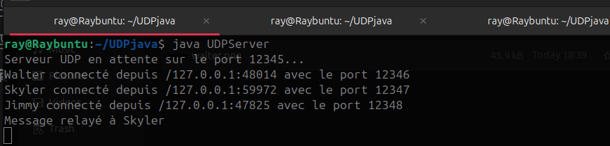
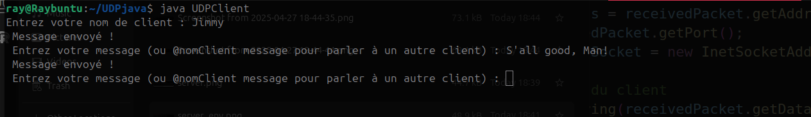
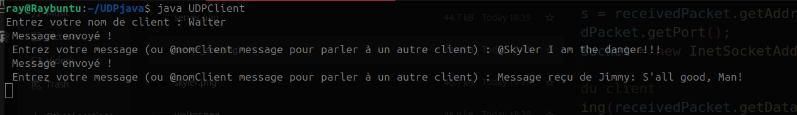
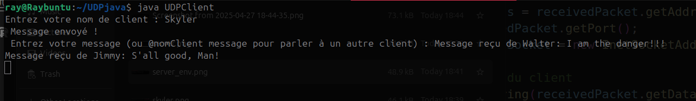

# 📡 Projet - Serveur et Client UDP en Java

## 📝 Présentation

Ce projet a été réalisé en binôme.  
Il met en œuvre un système de communication basé sur **UDP** entre un serveur et plusieurs clients, en utilisant **des threads** pour assurer la gestion simultanée des connexions et des échanges de messages.

---

## 🚀 Fonctionnalités principales

### Serveur (`UDPServer`)
- Gère plusieurs clients simultanément.
- Associe un **port dédié** à chaque client.
- **Relaye** les messages entre les clients.
- Utilise **des threads** pour traiter les messages sans bloquer le serveur.

### Client (`UDPClient`)
- Se connecte au serveur avec un **nom d'utilisateur**.
- Peut :
  - envoyer un message public à tous les clients,
  - envoyer un message privé à un client spécifique (`@nomClient`),
  - se **déconnecter** (`#exit`).
- Utilise **des threads** pour séparer l'envoi et la réception de messages.

---

## ⚙️ Comment exécuter le projet

### 1. Lancer le serveur
```bash
javac UDPServer.java
java UDPServer
```

### 2. Lancer un ou plusieurs clients
```bash
javac UDPClient.java
java UDPClient
```

Chaque client doit saisir son **nom d'utilisateur** au démarrage.

---

## 🔄 Fonctionnement général

- Lorsqu'un client envoie un message :
  - S'il commence par `@nomClient`, le message est envoyé uniquement au client ciblé.
  - Sinon, le message est diffusé à **tous** les clients connectés.
- Les clients peuvent quitter la communication avec la commande `#exit`.

---

## 🧵 Utilisation des Threads

- **Serveur** : Un thread pour la réception et un thread par message reçu.
- **Client** : Un thread pour l'envoi, un thread pour la réception.

---
## 📸 Captures d'écran

### 💻 Connexion de 3 clients au serveur

**Clients :**






**Serveur :**



### 🧑‍💻 Envoi de messages privé




**Serveur :**



### 🔗 Diffusion d'un message public







---

## 👥 Auteurs

- Rayen Ben Ammar
- Ilyass Bennani
